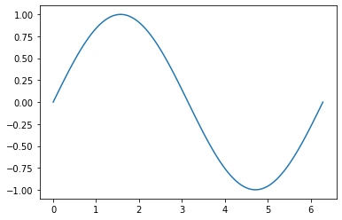

```python
import torch
```


```python
a = torch.tensor([1, 2, 3, 4])
```


```python
# Created tensor
a
```


    tensor([1, 2, 3, 4])


```python
# Checking the tensor type
a.type()
```


    'torch.LongTensor'


```python
# Type of data stored in the tensor
a.dtype
```


    torch.int64


```python
# Create a tensor of specific type
b = torch.FloatTensor([1, 2, 3, 4])
b.type()
```


    'torch.FloatTensor'


```python
# Size and dimension of a tensor
print(a.size())
print(a.ndimension())
```

    torch.Size([4])
    1


```python
# Adding a new dimension to a tensor
a_col = a.view(4, 1) # 4 rows and 1 column
# OR
a_col = a.view(-1, 1) # In case you don't know the number of rows, both do the same thing

a_col.size()
```


    torch.Size([4, 1])


```python
# Numpy array and tensors

import numpy as np

np_array = np.array([1, 2, 3, 4])
# From numpy array to a torch tensor
torch_tensor = torch.from_numpy(np_array)

# Back to torch tensor from a numpy array
back_to_np_array = torch_tensor.numpy()

"""
Here, the tensors and np_arrays carry reference of the ones they were assigned from
torch_tensor points back to np_array, and
back_to_np_array points back to torch_tensor

So, if you change the variable np_array, both torch_tensor and back_to_np_array change
"""

print(torch_tensor)
print(back_to_np_array)
```

    tensor([1, 2, 3, 4])
    [1 2 3 4]


```python
# Tensor to list
this_tensor = torch.tensor([1, 2, 3, 4])
this_tensor.tolist()
```


    [1, 2, 3, 4]


### Vector Addition and Subtraction


```python
u = torch.tensor([1.0, 2.1, 4.2])
v = torch.tensor([3.0, 1.9, -0.2])

z = u + v
z
```


    tensor([4.0000, 4.0000, 4.0000])


```python
# Multiplying two tensors
m = u * v

# Dot product of two tensors
d = torch.dot(u, v)

print(m)
print(d)
```

    tensor([ 3.0000,  3.9900, -0.8400])
    tensor(6.1500)


```python
# Adding a scalar to a tensor is similar to broadcasting in numpy
m+1
```


    tensor([4.0000, 4.9900, 0.1600])


### Universal Function in PyTorch


```python
m.mean()
```


    tensor(2.0500)


```python
m.max()
```


    tensor(3.9900)


### Getting evenly spaced numbers from one point (lower) to another (upper)


```python
torch.linspace(-2, 2, steps=9).type(torch.IntTensor)
```


    tensor([-2, -1, -1,  0,  0,  0,  1,  1,  2], dtype=torch.int32)


```python
# Plotting a sin(x) function
x = torch.linspace(0, 2*np.pi, 100)
y = torch.sin(x)

import matplotlib.pyplot as plt
%matplotlib inline
plt.plot(x.numpy(), y.numpy())
```


    [<matplotlib.lines.Line2D at 0x7f8cc3d07780>]




